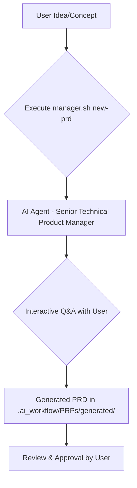
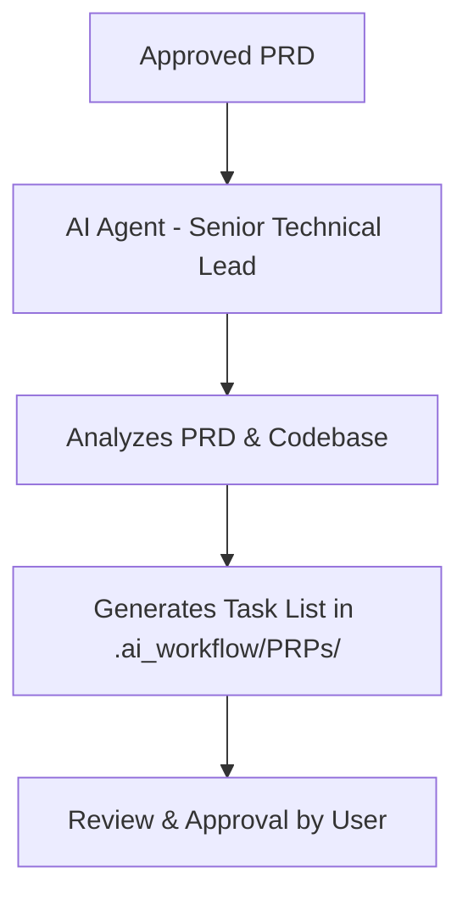
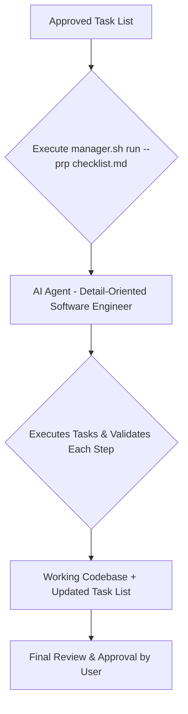
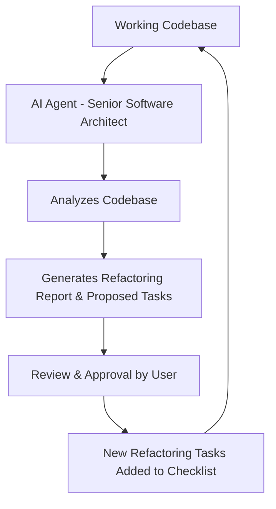

# 🚀 AI-Assisted Development Framework Guide 🚀

This guide provides a comprehensive overview of the AI-Assisted Development Framework, explaining its core components, workflows, and how to leverage each part effectively. It's designed to help you navigate from an initial idea to production-ready code with the power of AI.

## 🎯 Framework Version Status

**📋 For complete version information and development status, see [ARCHITECTURE.md - Framework Status](ARCHITECTURE.md#framework-status)**

**Current Version:** v1.0.0 (Stable Release - Production Ready)  
**Developer:** AnglDavd using Claude Code (Solo Developer Project)  
**License:** Custom Dual License  
**Cross-Platform Support:** Linux (full), macOS (good), Windows (limited via Git Bash/WSL)
**Major Features Completed:**
- ✅ **Automatic Quality Validation**: Adaptive language support for 30+ programming languages
- ✅ **Zero-Friction Automation**: Seamless background validation and pre-commit systems
- ✅ **CLI Integration**: Comprehensive command-line interface with advanced options
- ✅ **Master Architectural Documentation**: Complete system overview and development guidelines
- ✅ **Enhanced CLI System**: Production-ready UX with robust validation and error handling
- ✅ **External Feedback Integration**: Community feedback processing and framework synchronization
- ✅ **Framework-Level Task Management**: Organized processing of community contributions

## 🎯 Core Workflow: From Idea to Code

This section outlines the primary, end-to-end workflow for developing new features or products using the framework.

### 💡 Step 1: Ideation & Product Requirements Document (PRD) Creation

Every great feature starts with a clear understanding of the problem and the desired solution. The framework helps you formalize your ideas into a detailed PRD.

-   **Purpose:** To define *what* needs to be built and *why*.
-   **Key Tool:** `manager.sh new-prd`
-   **Underlying Prompt:** `.ai_workflow/create-prd.md`

### 📝 Step 2: Task Breakdown & Planning

Once the PRD is approved, the next step is to break down the high-level requirements into actionable, granular tasks that an AI agent can execute.

-   **Purpose:** To translate PRD requirements into a detailed, verifiable task list.
-   **Key Tool:** (Implicitly, the AI agent will use the PRD as context for the `generate-tasks.md` prompt)
-   **Underlying Prompt:** `.ai_workflow/generate-tasks.md`

### 🛠️ Step 3: Code Implementation & Execution

With a clear task list in hand, the AI agent can now proceed with implementing the code, validating each step along the way.

-   **Purpose:** To execute the task list, write code, and perform continuous validation.
-   **Key Tool:** `manager.sh run`
-   **Underlying Prompt:** `.ai_workflow/process-task-list.md`

### 🔄 Step 4: Review & Refactor (Continuous Improvement)

After significant development, it's crucial to review the codebase for technical debt, anti-patterns, and areas for optimization. This step ensures the long-term health of your project.

-   **Purpose:** To maintain code quality, identify refactoring opportunities, and ensure architectural integrity.
-   **Key Tool:** (Implicitly, the AI agent will use the `review-and-refactor.md` prompt)
-   **Underlying Prompt:** `.ai_workflow/review-and-refactor.md`

## ⚙️ Specialized Workflows & Commands

Beyond the core development cycle, the framework provides specialized commands for specific needs.

### 🚀 Direct Product Requirement Prompt (PRP) Creation

Sometimes, you might have a well-defined technical task that doesn't require a full PRD. In such cases, you can directly create a PRP.

-   **Purpose:** To generate a detailed, implementation-focused PRP for a specific feature or technical task.
-   **Key Tool:** `manager.sh new-prp`
-   **Underlying Prompts:**
    -   `.ai_workflow/commands/PRPs/prp-base-create.md` (for general features)
    -   `.ai_workflow/commands/PRPs/prp-spec-create.md` (for specification-driven transformations)
    -   `.ai_workflow/commands/PRPs/prp-task-create.md` (for focused task lists)

### 🏃 Rapid Development & Experimental Workflows

For hackathons or highly experimental features, the framework includes advanced, parallelized workflows. These are resource-intensive and require careful oversight.

-   **Purpose:** To accelerate development through parallel AI agent execution for complex research or implementation tasks.
-   **Underlying Prompts:** Located in `.ai_workflow/commands/rapid-development/experimental/`
    -   `create-base-prp-parallel.md`
    -   `create-planning-parallel.md`
    -   `hackathon-prp-parallel.md`
    -   `hackathon-research.md`
    -   `parallel-prp-creation.md`
    -   `user-story-rapid.md`

    **⚠️ Warning:** These prompts are highly experimental and can consume significant computational resources. Use with caution and monitor agent activity closely.

### 🔍 Code Quality & Review

Maintain high code standards with dedicated review and refactoring commands.

-   **Purpose:** To analyze code for quality, identify refactoring opportunities, and ensure adherence to best practices.
-   **Underlying Prompts:** Located in `.ai_workflow/commands/code-quality/`
    -   `refactor-simple.md`
    -   `review-general.md`
    -   `review-staged-unstaged.md`

### 🌳 Git Operations

Streamline your Git workflow with AI-assisted commands for common tasks.

-   **Purpose:** To simplify complex Git operations like conflict resolution and smart commits.
-   **Underlying Prompts:** Located in `.ai_workflow/commands/git-operations/`
    -   `conflict-resolver-general.md`
    -   `conflict-resolver-specific.md`
    -   `smart-resolver.md`

### 🚀 Development Utilities

General utilities to assist with various development tasks.

-   **Purpose:** To provide AI assistance for common development activities like debugging, onboarding, and project priming.
-   **Underlying Prompts:** Located in `.ai_workflow/commands/development/`
    -   `create-pr.md`
    -   `debug-RCA.md`
    -   `new-dev-branch.md`
    -   `onboarding.md`
    -   `prime-core.md`
    -   `smart-commit.md`

## 🔄 Framework Feedback Loop (Continuous Improvement)

To ensure the continuous improvement of the framework itself, a feedback mechanism has been integrated. After significant tasks are completed, the AI agent will suggest providing feedback on the framework's performance.

-   **Purpose:** To gather insights on the framework's usability, performance, and identify areas for enhancement.
-   **Privacy Note:** Any feedback submitted through this mechanism will **ONLY** pertain to the framework's functionality and suggestions for its improvement. **NO project-specific code, sensitive data, or private information will ever be included in these reports or GitHub issues.**
-   **Process:** The `process-task-list.md` prompt will prompt the user for feedback, and the `FRAMEWORK_ASSISTANT` will help generate a pre-filled `gh issue create` command for the main repository.

## 🤖 The Role of `ai-dev`

The `ai-dev` script is your primary interface with the AI-Assisted Development Framework. It acts as an orchestrator, simplifying the execution of complex AI agent prompts and workflows. Instead of directly interacting with individual `.md` prompt files, you use `ai-dev` to trigger the desired actions.

### Core Commands

**📋 For complete command reference and technical details, see [ARCHITECTURE.md - CLI Command Registry](ARCHITECTURE.md#command-registry)**

**Core Workflow Commands:**
-   **`./ai-dev setup`**: Initializes a new project with the framework
-   **`./ai-dev generate <prd_file>`**: Generate tasks from a Product Requirements Document
-   **`./ai-dev run <prp_file>`**: Execute a Project-Response-Plan file
-   **`./ai-dev optimize <prompt_file>`**: Optimize prompt files using best practices
-   **`./ai-dev performance <subcommand>`**: Performance optimization and monitoring

**Quality & Security Commands:**
-   **`./ai-dev quality <path>`**: Run quality validation with adaptive language support
-   **`./ai-dev audit`**: Run comprehensive security audit
-   **`./ai-dev precommit <subcommand>`**: Pre-commit validation and quality assurance

**Framework Management Commands:**
-   **`./ai-dev configure [options]`**: Configure framework settings
-   **`./ai-dev diagnose`**: Diagnose framework health and status
-   **`./ai-dev sync <subcommand>`**: Framework synchronization and external feedback

**Documentation & Maintenance Commands:**
-   **`./ai-dev generate-architecture`**: Generate project architecture documentation
-   **`./ai-dev update-architecture`**: Update existing architecture documentation
-   **`./ai-dev cleanup [options]`**: Manage obsolete files and repository cleanup
-   **`./ai-dev maintenance [level]`**: Run periodic repository maintenance
-   **`./ai-dev platform`**: Show platform compatibility information

**Utility Commands:**
-   **`./ai-dev help`**: Show all available commands
-   **`./ai-dev version`**: Framework version and platform information
-   **`./ai-dev status`**: Current framework status

### Advanced Features

-   **Automatic Quality Integration**: Quality validation runs automatically in pre-commit hooks, CLI commands, and PRP execution
-   **Adaptive Language Support**: Intelligent adaptation to 30+ programming languages without manual configuration
-   **Zero-Friction Automation**: Seamless background operations with minimal user intervention
-   **Comprehensive Validation**: Security, quality, and compliance checking integrated across all operations

By centralizing these operations, `ai-dev` provides a consistent and user-friendly experience, abstracting away the underlying complexity of prompt execution while maintaining powerful automation capabilities.
