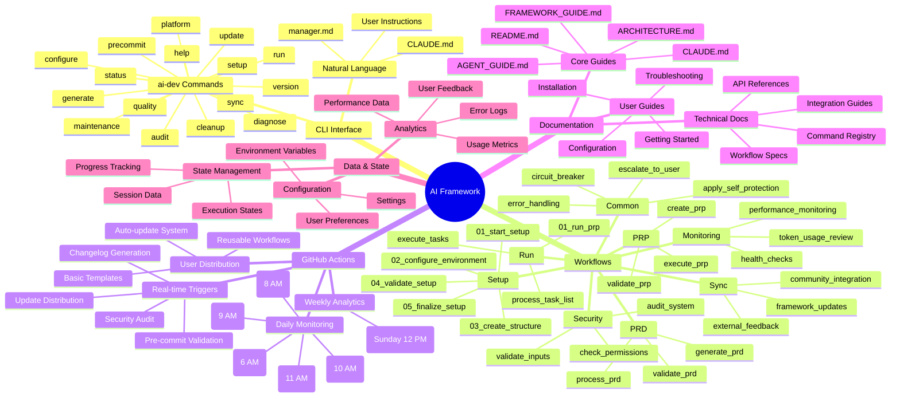
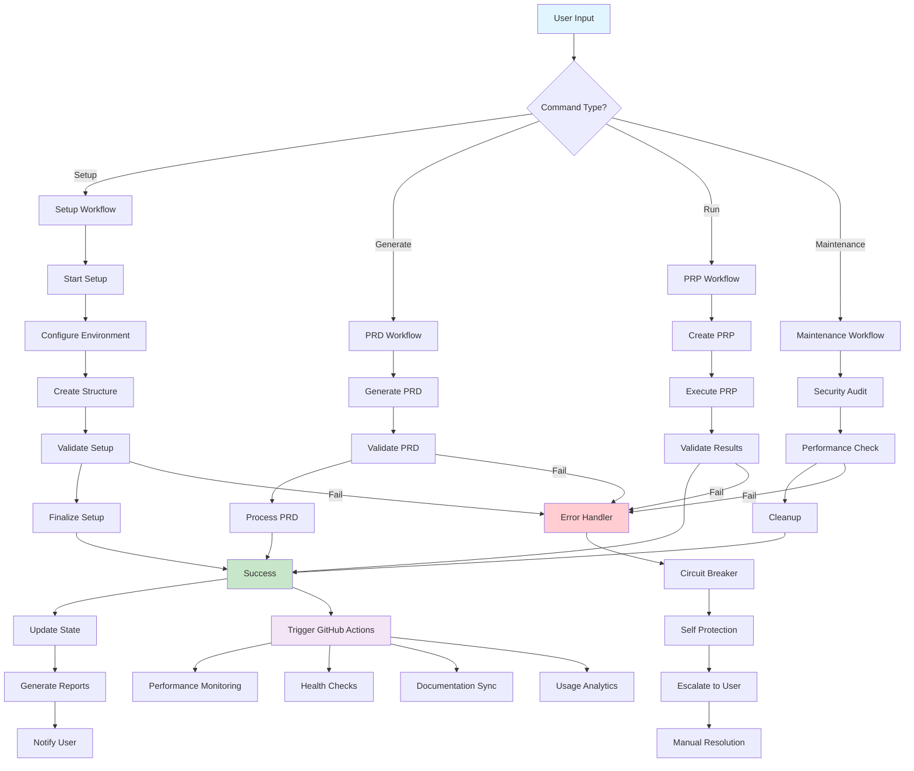
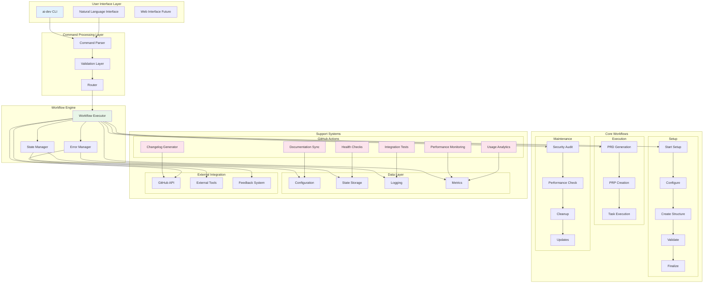
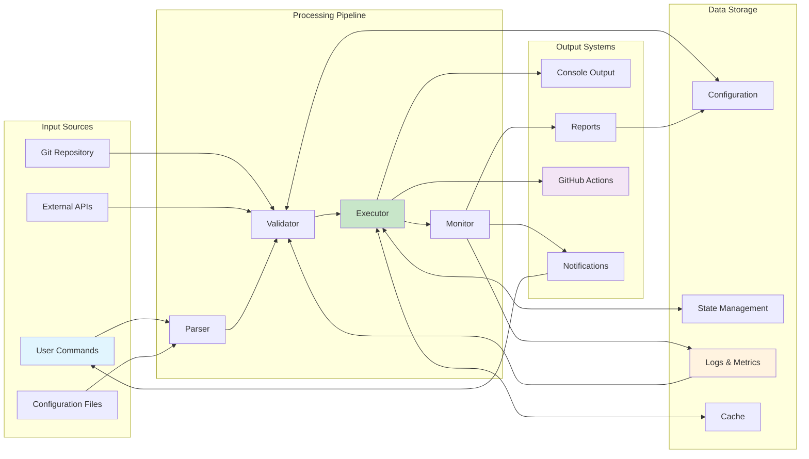
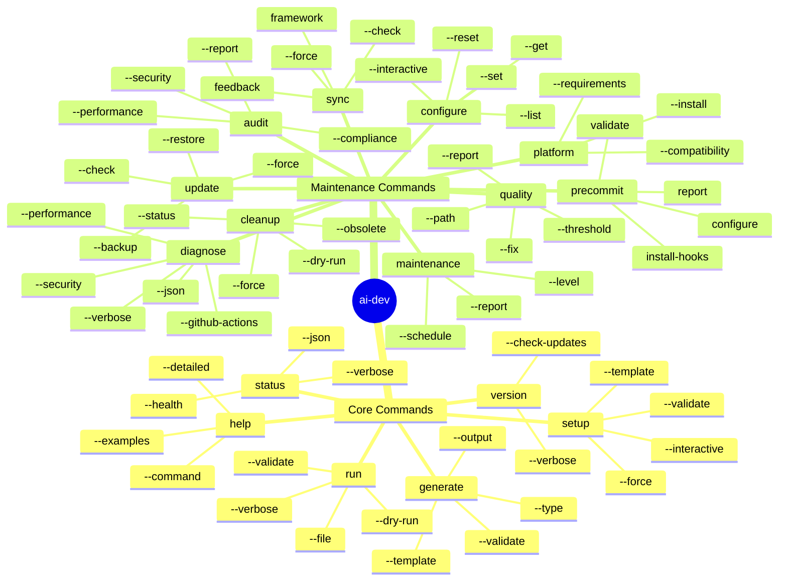
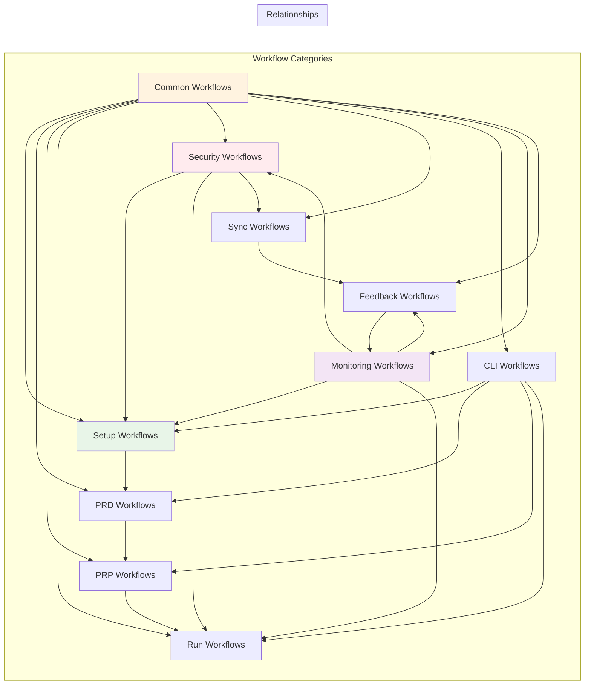
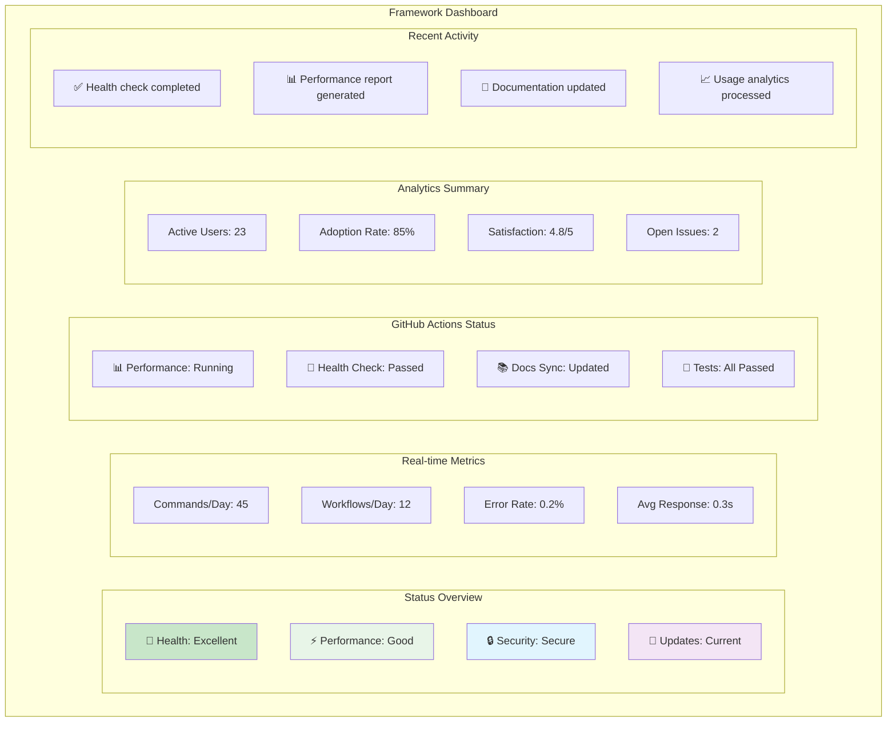
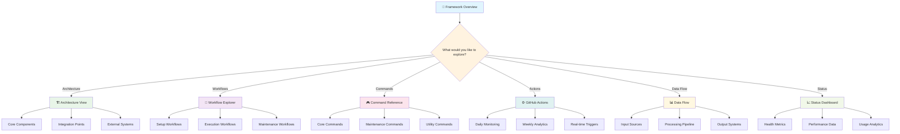

# 🗺️ Framework Visualization System

## 🎯 **Mapas Mentales y Diagramas del Framework**

Este documento contiene representaciones visuales completas del AI-Assisted Development Framework.

---

## 📊 **1. Mapa Mental Principal - Arquitectura General**



---

## 🔄 **2. Diagrama de Flujo - Workflow Execution**



---

## 🕐 **3. Cronograma Visual - GitHub Actions**

```mermaid
gantt
    title GitHub Actions Schedule
    dateFormat  HH:mm
    axisFormat %H:%M
    
    section Daily Monitoring
    Performance Monitoring    :crit, 06:00, 30m
    Health Check             :crit, 08:00, 30m
    Update Notifications     :active, 09:00, 30m
    Integration Testing      :active, 10:00, 45m
    Documentation Sync       :active, 11:00, 30m
    
    section Weekly Tasks
    Usage Analytics         :milestone, 12:00, 0m
    
    section Real-time Triggers
    Update Distribution     :done, 00:00, 24h
    Security Audit         :done, 00:00, 24h
    Pre-commit Validation  :done, 00:00, 24h
    Changelog Generation   :done, 00:00, 24h
```



---

## 🏗️ **4. Diagrama de Arquitectura - Componentes**



---

## 🔀 **5. Diagrama de Flujo de Datos**



---

## 🎮 **6. Mapa de Comandos Interactivo**



---

## 📊 **7. Matriz de Relaciones - Workflows**



---

## 🎯 **8. Dashboard Conceptual**



---

## 🔧 **9. Herramientas de Visualización**

### **Generadores de Mapas Mentales:**
- **Online**: [MindMeister](https://www.mindmeister.com/)
- **Desktop**: [XMind](https://www.xmind.net/)
- **Code**: [Mermaid Live Editor](https://mermaid.live/)

### **Comandos para Generar Diagramas:**
```bash
# Generar diagrama de arquitectura
./ai-dev generate-architecture --format=mermaid --output=architecture.md

# Generar mapa de workflows
./ai-dev generate-workflow-map --interactive

# Generar dashboard de estado
./ai-dev status --dashboard --export=html
```

### **Archivos de Configuración:**
- `docs/diagrams/` - Diagramas fuente
- `docs/visualizations/` - Visualizaciones generadas
- `docs/interactive/` - Mapas interactivos

---

## 🎮 **10. Navegación Interactiva**



---

## 🎯 **Uso de las Visualizaciones**

### **Para Desarrolladores:**
- Usar diagramas de arquitectura para entender el sistema
- Consultar mapas de workflows para modificaciones
- Revisar flujos de datos para debugging

### **Para Usuarios:**
- Navegar mapas de comandos para encontrar funcionalidad
- Consultar cronogramas para entender automatización
- Usar dashboard para monitorear estado

### **Para Mantenimiento:**
- Analizar matrices de relaciones para impacto de cambios
- Usar visualizaciones de GitHub Actions para optimización
- Consultar mapas mentales para planificación

---

*Este sistema de visualización proporciona una comprensión completa del framework desde múltiples perspectivas y niveles de detalle.*