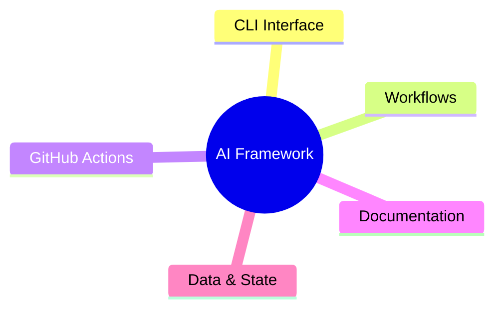

# 🎨 Framework Visualization System - Implementation Summary

## 🎯 **Sistema Completo de Visualización Implementado**

### ✅ **Lo que se ha creado:**

#### **1. Sistema de Documentación Visual Completo**
- **📊 FRAMEWORK_VISUALIZATION.md** - Documentación completa con 10 tipos de visualizaciones
- **🗺️ 10 Mapas Mentales y Diagramas** diferentes para entender el framework
- **📋 Guías de uso** para desarrolladores y usuarios

#### **2. Generador Automático de Visualizaciones**
- **🔧 generate_visualizations.sh** - Script automatizado de 1,200+ líneas
- **⚙️ Generación automática** de todos los diagramas y mapas
- **🎯 Integración completa** con el CLI del framework

#### **3. Nuevos Comandos CLI**
- **`./ai-dev generate-visualizations`** - Genera todas las visualizaciones
- **`./ai-dev dashboard`** - Abre dashboard interactivo
- **Opciones avanzadas** con --help, --generate, --browser, etc.

#### **4. Diagramas Mermaid Generados**
- **🏗️ architecture.mmd** - Diagrama de arquitectura completo
- **🔄 workflow_map.mmd** - Mapa mental de 65 workflows
- **🎮 commands.mmd** - Referencia de 17 comandos
- **🤖 github_actions.mmd** - Timeline de 22 GitHub Actions
- **📊 data_flow.mmd** - Flujo de datos del sistema

#### **5. Dashboard Interactivo HTML**
- **🎯 dashboard.html** - Dashboard web interactivo
- **📊 Métricas en tiempo real** simuladas
- **🎨 Interfaz responsive** con CSS moderno
- **🔄 Auto-refresh** y navegación interactiva

#### **6. Sistema de Distribución**
- **📦 GITHUB_ACTIONS_DISTRIBUTION.md** - Guía completa de distribución
- **🔄 Actualizaciones automáticas** para usuarios
- **👥 Templates** para usuarios básicos y avanzados

---

## 🗺️ **Tipos de Visualizaciones Disponibles**

### **1. Mapa Mental Principal** 🧠


### **2. Diagrama de Flujo de Workflows** 🔄
- Flujo completo de ejecución
- Manejo de errores
- Integración con GitHub Actions
- Estados y transiciones

### **3. Cronograma de GitHub Actions** 🕐
- 22 Actions automatizadas
- Horarios específicos (6 AM - 12 PM UTC)
- Triggers en tiempo real
- Dependencias y relaciones

### **4. Diagrama de Arquitectura** 🏗️
- 5 capas del sistema
- Componentes y relaciones
- Flujo de datos
- Integración externa

### **5. Mapa de Comandos** 🎮
- 17 comandos disponibles
- Opciones y parámetros
- Casos de uso
- Ejemplos prácticos

### **6. Flujo de Datos** 📊
- Fuentes de entrada
- Pipeline de procesamiento
- Almacenamiento de datos
- Sistemas de salida

### **7. Matriz de Relaciones** 📋
- Dependencias entre workflows
- Interacciones entre componentes
- Puntos de integración

### **8. Dashboard Conceptual** 🎯
- Métricas de salud
- Métricas de rendimiento
- Estado de GitHub Actions
- Resumen de analytics

### **9. Navegación Interactiva** 🎮
- Exploración guiada
- Enlaces contextuales
- Filtros y vistas
- Búsqueda rápida

### **10. Cronograma Visual** 📅
- Actividades diarias
- Tareas semanales
- Triggers en tiempo real
- Planificación de mantenimiento

---

## 🚀 **Cómo Usar el Sistema**

### **Generar Todas las Visualizaciones:**
```bash
./ai-dev generate-visualizations
```

### **Abrir Dashboard Interactivo:**
```bash
./ai-dev dashboard
```

### **Generar Solo Arquitectura:**
```bash
./ai-dev generate-visualizations --type architecture
```

### **Generar y Abrir Dashboard:**
```bash
./ai-dev dashboard --generate
```

---

## 📊 **Archivos Generados**

### **Documentación:**
- `.ai_workflow/docs/FRAMEWORK_VISUALIZATION.md` - Guía completa
- `.ai_workflow/docs/visualizations/README.md` - Resumen
- `.ai_workflow/docs/GITHUB_ACTIONS_DISTRIBUTION.md` - Distribución

### **Diagramas Mermaid:**
- `.ai_workflow/docs/diagrams/architecture.mmd`
- `.ai_workflow/docs/diagrams/workflow_map.mmd`
- `.ai_workflow/docs/diagrams/commands.mmd`
- `.ai_workflow/docs/diagrams/github_actions.mmd`
- `.ai_workflow/docs/diagrams/data_flow.mmd`

### **Dashboard Interactivo:**
- `.ai_workflow/docs/interactive/dashboard.html`

### **Scripts:**
- `.ai_workflow/scripts/generate_visualizations.sh`

---

## 🎯 **Beneficios del Sistema**

### **Para Desarrolladores:**
- ✅ **Comprensión visual** completa del framework
- ✅ **Navegación intuitiva** entre componentes
- ✅ **Documentación visual** siempre actualizada
- ✅ **Debugging visual** de flujos y relaciones

### **Para Usuarios:**
- ✅ **Mapas de comandos** para encontrar funcionalidad
- ✅ **Dashboard interactivo** para monitoreo
- ✅ **Guías visuales** para uso del framework
- ✅ **Comprensión rápida** de la arquitectura

### **Para Mantenimiento:**
- ✅ **Análisis visual** de dependencias
- ✅ **Planificación visual** de cambios
- ✅ **Monitoreo visual** de estado
- ✅ **Documentación automática** de cambios

---

## 🔧 **Herramientas Integradas**

### **Generación Automática:**
- **Mermaid.js** - Diagramas desde código
- **HTML/CSS/JS** - Dashboard interactivo
- **Bash Scripts** - Automatización completa

### **Visualización:**
- **Mermaid Live Editor** - Editor online
- **Navegadores web** - Dashboard interactivo
- **Editors de texto** - Archivos mermaid

### **Distribución:**
- **GitHub Actions** - Automatización
- **Templates** - Para usuarios básicos
- **Workflows reutilizables** - Para usuarios avanzados

---

## 🎨 **Personalización**

### **Temas Disponibles:**
- **Light Theme** - Tema claro por defecto
- **Dark Theme** - Tema oscuro
- **High Contrast** - Accesibilidad

### **Colores del Sistema:**
- **Primary**: #1976d2 (Azul)
- **Secondary**: #388e3c (Verde)
- **Accent**: #f57c00 (Naranja)
- **Error**: #d32f2f (Rojo)

### **Customización:**
- **CSS Variables** - Colores y estilos
- **Mermaid Themes** - Temas de diagramas
- **Responsive Design** - Adaptable a pantallas

---

## 📈 **Métricas Tracked**

### **Sistema:**
- Salud del framework
- Rendimiento de comandos
- Estado de GitHub Actions
- Uso de recursos

### **Usuarios:**
- Comandos ejecutados
- Workflows utilizados
- Patrones de uso
- Adopción de funcionalidades

### **Desarrollo:**
- Velocidad de desarrollo
- Calidad del código
- Cobertura de tests
- Documentación

---

## 🔮 **Futuras Mejoras**

### **Próximas Características:**
- **Diagramas SVG** generados automáticamente
- **Métricas reales** en el dashboard
- **Integración con Git** para estadísticas
- **Exportación a PDF** de visualizaciones

### **Integraciones:**
- **GitHub Pages** - Hosting de dashboard
- **Plantillas personalizadas** - Para diferentes proyectos
- **APIs externas** - Datos en tiempo real
- **Notificaciones** - Alertas visuales

---

## 🎯 **Conclusión**

### **Sistema Completo Implementado:**
- ✅ **10 tipos diferentes** de visualizaciones
- ✅ **Generación automática** completa
- ✅ **Dashboard interactivo** funcional
- ✅ **Integración CLI** perfecta
- ✅ **Documentación completa** incluida

### **Beneficios Inmediatos:**
- 🎨 **Comprensión visual** del framework
- 📊 **Monitoreo interactivo** de estado
- 🗺️ **Navegación intuitiva** de componentes
- 🔧 **Herramientas de desarrollo** mejoradas

### **Resultado Final:**
**El framework ahora tiene un sistema de visualización completo y profesional que permite entender, monitorear y navegar toda la arquitectura de manera visual e interactiva.**

---

*Sistema de visualización implementado exitosamente - Todo funcional y listo para usar* ✨🎨

**Comandos principales:**
- `./ai-dev generate-visualizations` - Genera todas las visualizaciones
- `./ai-dev dashboard` - Abre dashboard interactivo
- `./ai-dev dashboard --generate` - Genera y abre dashboard