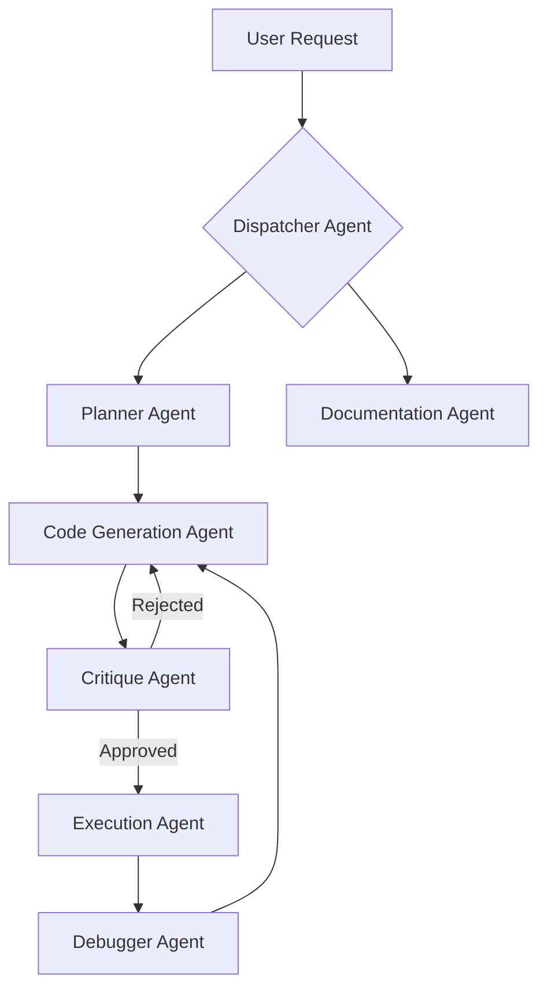

# Multi-Agent Architecture: Design Document

## 1. Vision & Goal

The goal is to evolve the framework from a single agent that adopts different roles to a true multi-agent system. In this model, a primary **Dispatcher Agent** coordinates a team of specialized, expert agents, each with a distinct responsibility. This architecture will lead to more robust, maintainable, and powerful capabilities.

## 2. High-Level Architecture

The system will be orchestrated by the **Dispatcher Agent**. When a user makes a request, the Dispatcher analyzes it and routes it to the appropriate specialist agent. The agents communicate and share state via a well-defined context object.

## 3. Core Components

### A. The Dispatcher Agent (`dispatcher.md`)
-   **Role:** The central coordinator and router.
-   **Responsibility:**
    1.  Receives the initial user request.
    2.  Analyzes the user's intent.
    3.  Initializes a `SharedState` object (see below).
    4.  Invokes the first specialist agent in the appropriate workflow (e.g., the Planner Agent for a new feature).
-   This will likely become the new entry point for most complex commands.

### B. The Shared State Object
-   **Concept:** A JSON or YAML object passed between agents. It contains all necessary context for the entire operation.
-   **Contents:**
    -   `user_request`: The original, unmodified user prompt.
    -   `current_prp`: The path to the PRP being worked on.
    -   `file_context`: A list of files relevant to the current task.
    -   `last_error`: The output of the last failed validation or command.
    -   `session_log`: A summary of actions taken so far.
-   **Mechanism:** Each agent receives the state, performs its task, and then updates the state before passing it to the next agent.

### C. Specialist Agents (Examples)

Each of these will be a dedicated prompt file, similar to how we've built `critique-prp.md`.

1.  **Planner Agent (`planner.md`)**
    -   **Supersedes:** `generate-tasks.md`.
    -   **Responsibility:** Takes a high-level goal and produces a detailed, structured PRP.

2.  **Code Generation Agent (`code_generator.md`)**
    -   **Responsibility:** Takes a single task from a PRP and generates the corresponding code. It does not execute or validate, it only writes code.

3.  **Critique Agent (`critique-prp.md`)**
    -   **Exists:** We have already designed this.
    -   **Responsibility:** Evaluates the output of the Planner or Code Generator.

4.  **Execution Agent (`01_run_prp.md`)**
    -   **Exists:** We have already designed this.
    -   **Responsibility:** Executes the actions and validations in a PRP.

5.  **Debugger Agent (`debugger.md`)**
    -   **Role:** A specialist in root cause analysis.
    -   **Responsibility:** When the Execution Agent's self-correction loop fails, the Debugger is invoked. It analyzes the full error log and the related code to propose a more intelligent, targeted fix than the simple "retry" logic.

6.  **Documentation Agent (`doc_writer.md`)**
    -   **Responsibility:** After a feature is successfully implemented, this agent is called to update any relevant documentation (e.g., READMEs, API docs).

## 4. Implementation Plan (High-Level)

1.  **[Task 1]** Refactor the existing prompts (`generate-tasks`, `critique-prp`, `run-prp`) to operate as specialist agents that accept and return a `SharedState` object.
2.  **[Task 2]** Create the new specialist agent prompts (e.g., `debugger.md`, `doc_writer.md`).
3.  **[Task 3]** Design and implement the master `dispatcher.md` prompt.
4.  **[Task 4]** Update the CLI entry points to use the Dispatcher Agent instead of calling workflows directly.
