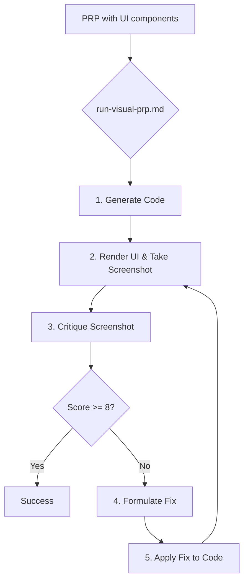

# UI Self-Healing: Design Document

## 1. Vision & Goal

The goal of the UI Self-Healing capability is to extend the framework's "critique and self-correction" loop to the visual frontend. The system should be able to:

1.  **Generate** UI code based on a PRP.
2.  **Visually render** the generated UI in a headless browser.
3.  **Analyze** a screenshot of the UI against the project's established style guides.
4.  **Score** the UI's compliance.
5.  **Automatically generate and apply fixes** to the code if the score is below a certain threshold.

This creates a powerful feedback loop that ensures not only functional correctness but also visual and stylistic consistency.

## 2. High-Level Architecture & Flow

The process will be orchestrated by a new master workflow, tentatively named `run-visual-prp.md`.

## 3. Components & Prompts

### A. `run-visual-prp.md` (The Orchestrator)
-   This workflow will manage the overall process.
-   It will call the standard `01_run_prp.md` engine to generate the initial code.
-   After the code is generated, it will trigger the rendering and critique loop.

### B. Rendering & Screenshot Tool (External Dependency)
-   **Tool:** Playwright with a Multi-modal Capability Pack (MCP) or a similar tool.
-   **Action:** A new abstract tool, `RENDER_AND_CAPTURE(url, viewport)`, will be needed. This tool will:
    1.  Start the local development server.
    2.  Navigate to the specified URL.
    3.  Take a screenshot of the rendered component.
    4.  Return the screenshot as a base64 encoded image.

### C. `visual-critique.md` (The Visual Critic Agent)
-   **Role:** A "UI/UX Quality Engineer".
-   **Input:**
    1.  The screenshot of the UI.
    2.  The contents of `style-guide.md` and `ux-rules.md`.
-   **Process:**
    1.  Analyze the image.
    2.  Compare it against the rules in the provided style documents.
    3.  Generate a score and a list of specific, actionable critiques.
-   **Output:** A JSON object containing a score and a list of required changes (e.g., `{"score": 6.5, "critiques": ["The primary button color is incorrect. Expected #007BFF, but got #3399FF.", "The spacing between the heading and the body text is 12px, but should be 16px."]}`).

### D. `fix-ui-code.md` (The UI Code Refactor Agent)
-   **Role:** A "Frontend Developer".
-   **Input:**
    1.  The path to the UI component's source code.
    2.  The JSON object of critiques from the `visual-critique.md` agent.
-   **Process:**
    1.  Read the source code.
    2.  For each critique, formulate a targeted `REPLACE_IN_FILE` action to fix the code.
-   **Output:** A series of `replace` tool calls.

## 4. Prerequisites & Dependencies

-   The project must have a working development server that can be started with a single command (e.g., `npm run dev`).
-   An external tool like Playwright/MCP must be installed and available in the system's PATH.

## 5. Implementation Plan (High-Level)

1.  **[Task 1]** Implement the dependency checker workflow.
2.  **[Task 2]** Define the new abstract tool `RENDER_AND_CAPTURE`.
3.  **[Task 3]** Create the `visual-critique.md` prompt.
4.  **[Task 4]** Create the `fix-ui-code.md` prompt.
5.  **[Task 5]** Create the master `run-visual-prp.md` orchestrator workflow.
